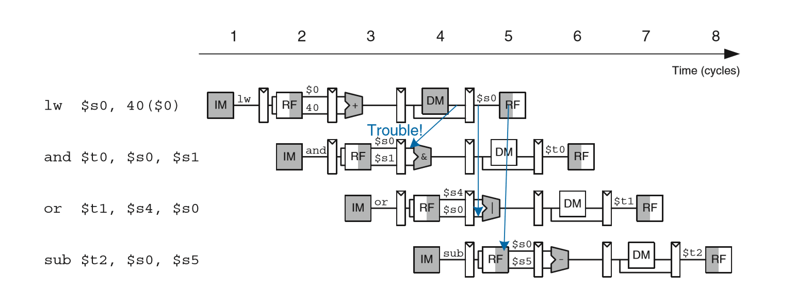
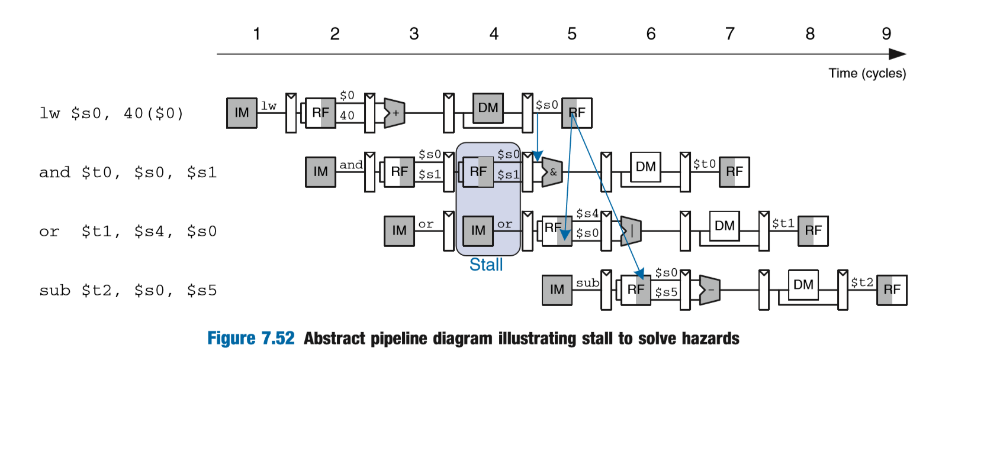

# Lab_1实验报告

### PB16060341	祝冠琪

## NPC_Generator

在这个模块中，根据不同的跳转信号选择不同的新PC值。

- 若BranchE==1，则PC_IN=BranchTarget

- 若JalD==1，则PC_IN=JalTarget
- 若JalrE==1，则PC_IN=JalrTarget
- 其他情况，PC_IN=PCF+4

## IDSegReg

这个阶段我们需要完成的是一个取指令的操作。在助教给的模板中，我们需要完成的就是InstructionRam的fetch操作，因为是上升沿同步读取，所以我们只需要把.clk设置成clk即可。然后因为我们这个cpu是四字节对齐的，所以我们的.addra应该设置成PCF[31:2]。综上我们就完成了设计。

## ControlUnit

### Load

#### LB

- op=0000011
- fn3=000
- RegWrite[2:0]=LB
- MemtoRegD=1
- RegReadD=1
- AluContrlD=ADD
- AluSrc1D=0
- Alusrc2D=10
- ImmType=ITYPE

其他load指令同理。

### Store

关于store实际上实现起来和Load指令差不多，但我们需要注意的是，在写的时候，因为有字节，半字，全字的差别，所以我们需要用MemWriteD[3:0]来确认到底是哪一种，然后这是四位独热码，0001代表写入最低一个byte，其他位置的byte也类似。

### ALU

对于ALU指令实际上是比较简单的，因为相对于Store和Load指令，ALU相关的信号更少一些。我们只需要确定好AluContrlD，Alusrc1D，Alusrc2D即可。

### Branch

关于Branch指令，我们只需要控制好BranchTypeD即可，选择正确的分支类型就可以了。

### JAL&JALR

关于跳转指令，我们只需要根据具体指令分别将JalD或者JalrD置一即可。

## ImmOperandUnit

这个部分主要是根据不同指令需求来生成立即数。助教已经完成了ITYPE的部分。

#### RTYPE

Jalr型指令, out<={{21{In[31]}},In[30:20]};

#### STYPE

STYPE是Store所用的立即数应该为out<={{26{In[11]}},In[10:5]};

#### BTYPE

BTYPE是Branch所用的指令，立即数应该为out<={{20{In[31]}},In[7],In[30:25],In[4:1],{0}};

#### UTYPE

UTYPE是load upper imm的立即数类型，out<={{23{In[31]}},In[30:12]};

#### JTYPE

JTYPE是JAL跳转指令的立即数类型，out<={{12{In[31]}},In[19:12], In[20], In[30:21], {0}};

## ALU

ALU模块比较简单，根据AluContrl信号用case语句选择运算方式即可。但是需要注意的是，ALU中传入的wire型变量默认是无符号型的，所以进行一些带符号运算时需要转换成有符号数。

## BranchDecisionMaking

BranchDecisionMaking接受两个操作数，根据BranchTypeE的不同，进行不同的判断，当分支应该taken时，令BranchE=1'b1。至于BranchTypeE的类型在Parameters已经定义了。

## DataExt

这个模块是用来处理非对齐load的情形。对于不同RegWruteW，根据LoadedBytesSelect的信息即可确定需要In里面的哪几个Byte。然后若读出来的是无符号数或正数，则在开头补0扩展到32位；若读出来的是负数，则在开头补1扩展到32位。然后OUT输出。

## HarzardUnit

### 数据相关

可以由以下代码处理

```verilog
always@(*) begin
    if(RegReadDE[1]==1 && Rs1E == RDM && RegWriteM)
		Forward1E = 2'b10;
	else if(RegReadDE[1]==1 && Rs1E == RDW && RegWriteW)
		Forward1E = 2'b01;
	else
		Forward1E = 2'b00;
				
    if(RegReadDE[0]==1 && Rs2E == RDM && RegWriteM)
	     Forward2E = 2'b10;
    else if(RegReadDE[0]==1 && Rs2E == RDW && RegWriteW)
	     Forward2E = 2'b01;
	else
	     Forward2E = 2'b00;
```

但是如上代码只能处理部分RAW，因为如果是lw指令，可能并无法进行forward操作，所以我们需要stall，代码如下

```verilog
lwstall = ((Rs1D == Rs1E) || (Rs2D == Rs2E)) && MemtoRegE;
```

### 控制相关

#### branch指令

控制相关当中，我们是假设Branch指令默认不跳转，那样的话，一开始就是自然地加载指令。而如果是跳转了，因为branch指令到EX阶段才计算出跳转的地址，所以我们需要将下面之前加载的两条多余指令flush掉。所以我们需要做的就是flush掉IF、ID、EX段寄存器。

#### Jal&Jalr

因为Jal的目的地址是在ID阶段就完成了，所以只需要flush一条多余的指令即可。所以我们只需要flush掉IF与ID段寄存器。

而jalr的目的地址是在EX阶段才计算完成，所以也需要flush掉两条多余的指令。所以我们需要做的就是flush掉IF、ID、EX段寄存器。

## WBSegReg

需要补全的部分，因为是上升沿更新，所以.clk就是clk；.wea填的就是WE，这里的WE是独热码，指示了需要存储的Byte；寻址仍是按字寻址，所以.addra应该是A[31:2]；最后.dina就是想要存入的WD。

## 问题

### 1、为什么将DataMemory和InstructionMemory嵌入在段寄存器中？

因为我们这边软件只能实现同步读取数据，所以若不嵌入在段寄存器内，再连接一个D触发器的话，我们就会变成2个clock才将数据存入段寄存器，这显然是不对的。

### 2、DataMemory和InstructionMemory输入地址是字（32bit）地址，如何将访存地址转化为字地址输入进去？

因为我们默认是字对齐的，所以访存地址的最低两位一定是0，所以将访存地址右移两位即可。

### 3、如何实现DataMemory的非字对齐的Load？

先按字寻址，读出mem中32位的数据，然后在DataExt模块中，根据RegWriteW判断是哪一种读取模式，接着根据LoadedBytesSelect来判断需要哪几个Byte的数据。最后根据市有符号扩展还是无符号扩展，扩展到32位数据然后输出。

### 4、如何实现DataMemory的非字对齐的Store？

运用一个4bits的独热码，如果是0001那么代表最低一byte被写，如果是0100那么代表第三个byte被写，其他同理。半字对齐也同理。

### 5、为什么RegFile的时钟要取反？

若没有取反，那么上升沿的时候WB才能写入寄存器，那样的话WB阶段需要在第六个阶段才能够结束，这显然不符合五级流水线的设定。

### 6、NPC_Generator中对于不同跳转target的选择有没有优先级？

有。因为假如先是一条Jalr指令，然后再跟着一条Jal指令，那么如果两条指令都跳转，则跳转指令的信号是在同一个cycle到NPC_Generator的

### 7、ALU模块中，默认wire变量是有符号数还是无符号数？

可以直接指定为有符号数还是无符号数。

### 8、AluSrc1E执行哪些指令时等于1’b1？

执行AUIPC时

### 9、AluSrc2E执行哪些指令时等于2‘b01？

SLLI, SRLI, SRAI

### 10、哪条指令执行过程中会使得LoadNpcD==1？

JALR和JAL，会将NPC值写入rd寄存器

### 11、DataExt模块中，LoadedBytesSelect的意义是什么？

LoadedBytesSelect是读Data Memory地址的低两位。因为DataMemory是按字（32bit）进行访问的，所以需要把字节地址转化为字地址传给DataMem，DataMem一次返回一个字，LoadedBytesSelect用来从32bit字中挑选出我们需要的字节。

### 12、Harzard模块中，有哪几类冲突需要插入气泡？

在load指令时有可能用到气泡。具体情形为如下图



所以我们需要用stall冻结IF和ID段



### 13、Harzard模块中采用默认不跳转的策略，遇到branch指令时，如何控制flush和stall信号？

因为默认不跳转，所以只有当遇到实际要进行跳转的情况，才会对下面已经执行的多余两条指令进行flush。

### 14、Harzard模块中，RegReadE信号有什么用？

判断处于ex段的rs1和rs2是否被用到，没用到的话，就不需要forward。

### 15、0号寄存器值始终为0，是否会对forward的处理产生影响？

会，因为0号寄存器的值始终都是0，然后如果我们之前一条指令是往0号寄存器写入值，然后下一条指令用到了0号寄存器。这样如果forward了，那样参与运算就不会是0了，但是寄存器0始终是0，所以就不对了。所以对于R0寄存器，是不能进行forward处理的。

