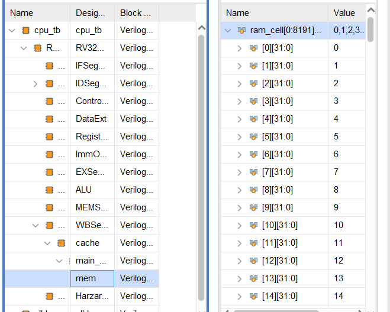

# 计算机体系结构Lab3实验报告

<div align="right"><b>PB16060341 祝冠琪</b></div>

## 实验目标

1. 权衡cache size增大带来的命中率提升收益和存储资源电路面积的开销

2. 权衡选择合适的组相连度（相连度增大cache size也会增大，但是冲突miss会减低）

3. 体会使用复杂电路实现复杂替换策略带来的收益和简单替换策略的优势（有时候简单策略比复杂策略效果不差很多甚至可能更好）

4. 理解写回法的优劣

## 实验环境和工具

- 实验环境：windows10
- 实验工具：Vivado
- 实验方式：Vivado自带的波形仿真、综合报告

## 实验内容和过程

### 阶段一

阶段一需要理解助教提供的直接映射策略的cache，将它修改为N路组相连的cache，并通过助教提供的cache读写测试。

#### FIFO

对于FIFO我们只需要对于每一个组，分别用一个变量记录该组应该换出的变量即可。数据结构如下

```verilog
integer FIFO_Choice [SET_SIZE];
```

选路时只需要在需要换出时，根据不同的组编号，选择相应的路数即可。实现如下

```verilog
way_choice = FIFO_Choice[set_addr];
```

选路完成后，需要对每一组的换出变量进行更新

```verilog
FIFO_Choice[set_addr] <= (FIFO_Choice[set_addr] + 1) % WAY_CNT;
```

这样实现的原因是，FIFO策略是先进先出，那样的话实际上就是一个循环队列，按照顺序进行更新即可。

#### LRU

LRU策略是换出最长时间未被使用的块。所以对于每一组每一路，我们分别用一个变量来记录这一路最近的访问的时间，那么换出的时候，只需要换出访问时间最小的那一路即可。

选路操作如下

```verilog
way_choice = 0;
        for (integer i=0; i<WAY_CNT; i++) begin
            if (way_num_cnt[set_addr][i] < way_num_cnt[set_addr][way_choice]) begin
                way_choice = i;
            end
        end
```

当块被命中时，需要更新记录的时间

```verilog
way_num_cnt[set_addr][way_idx] = time_cnt;
```

对于新换入的块，也需要记录其时间

```verilog
way_num_cnt[set_addr][way_choice] <= time_cnt;
```

我这样实现有一个问题，就是时间的记录可能会溢出。对于这个问题我是这样想的。首先，需要经过很长一段时间才会产生溢出，并且溢出造成的换入换出异常持续的时间并不会很长。如果用别的实现，能够避免溢出的问题，但可能会用更加复杂的硬件实现，所需要的代价和时间溢出的代价可能会差不多。其次，在这个实验中，仿真并不会造成溢出的问题。

#### 结果

这两种实现方法结果都如下图


可以看到通过了助教所给的样例的测试。

### 阶段二

#### 正确性测试

阶段二是cpu+cache的联合测试，下面是测试结果：

**矩阵乘法结果**


**快速排序结果**



可以看到运行结果都是正确的

### 阶段三

阶段三，我做了多组实验，来体会不同多路组相连策略带来的效率开销和不同换入换出策略带来的效率开销的不同。实验结果如下。

**注：以下实验均保持主存大小为$2^{13}$个字，一个块的大小为8个字。快排规模为512个数，矩阵乘法规模为32*32。**

#### 保持cache大小不变，设置不同的路数与组数的比较

**FIFO**

| 组数 | 组相连度 | LUT  | FF    | 矩阵时间/ns | 矩阵乘法缺失率 | 快排时间/ns | 快排缺失率 |
| ---- | -------- | ---- | ----- | ----------- | -------------- | ----------- | ---------- |
| 32   | 1        | 4508 | 10470 | 9971460     | 0.539423       | 475864      | 0.029064   |
| 16   | 2        | 4067 | 9990  | 9696948     | 0.520373       | 435316      | 0.020267   |
| 8    | 4        | 4308 | 9762  | 9761316     | 0.52485        | 426832      | 0.018456   |
| 4    | 8        | 6211 | 9637  | 17780500    | 0.541346       | 561728      | 0.03053    |

**LRU**

| 组数 | 组相连度 | LUT  | FF    | 矩阵时间/ns | 矩阵乘法缺失率 | 快排时间/ns | 快排缺失率 |
| ---- | -------- | ---- | ----- | ----------- | -------------- | ----------- | ---------- |
| 32   | 1        | 4173 | 9446  | 9971460     | 0.539423       | 475864      | 0.029064   |
| 16   | 2        | 5312 | 10543 | 9777300     | 0.525962       | 429392      | 0.01906    |
| 8    | 4        | 4566 | 10567 | 9777300     | 0.525962       | 423812      | 0.017853   |
| 4    | 8        | 6551 | 10567 | 17784852    | 0.525962       | 571384      | 0.028978   |

通过比较数据我们可以得出以下结论：

1. 对于同一种换入换出策略随着组相连度的增加，运行时间呈现先减小后增加的趋势。

2. 对于同一种换入换出策略随着组相连度的增加，缺失率呈现先减小后增加的趋势。

3. 对于32*32的矩阵，两种策略的缺失率都比较高。

4. 快速排序的缺失率都比较低。

5. LRU和FIFO比较，可以看到对于快速排序，LRU基本上都比FIFO运行结果要好，更低的缺失率，更少的运行时间。但对于矩阵乘法运算，LRU没有优势，甚至还有一定的劣势。

6. 除了直接映射的情况，其他情况下LRU比FIFO消耗更多的硬件资源。

#### 路数相同，不同cache大小间的比较

**FIFO**

| 组数 | 组相连度 | LUT  | FF    | 矩阵时间/ns | 矩阵乘法缺失率 | 快排时间/ns | 快排缺失率  |
| ---- | -------- | ---- | ----- | ----------- | -------------- | ----------- | ----------- |
| 4    | 4        | 4219 | 5408  | 9998484     | 0.541346154    | 487424      | 0.030530401 |
| 8    | 4        | 4308 | 9762  | 9761316     | 0.52484976     | 426832      | 0.018456231 |
| 16   | 4        | 7671 | 18441 | 7798324     | 0.39140625     | 382328      | 0.009486848 |

**LRU**

| 组数 | 组相连度 | LUT   | FF    | 矩阵时间/ns | 矩阵乘法缺失率 | 快排时间/ns | 快排缺失率 |
| ---- | -------- | ----- | ----- | ----------- | -------------- | ----------- | ---------- |
| 4    | 4        | 4532  | 5830  | 9777300     | 0.525962       | 479800      | 0.028978   |
| 8    | 4        | 4566  | 10567 | 9777300     | 0.525962       | 423812      | 0.017853   |
| 16   | 4        | 10202 | 20029 | 9765204     | 0.52512        | 380636      | 0.009142   |
| 32   | 4        | 18152 | 38904 | 3681780     | 0.101983       | 未测        | 未测       |

**注：因为16，4这一组矩阵乘法得到的优化不够明显，所以我又对于矩阵乘法重新测了一组32，4的**

通过比较数据我们可以得出以下结论：

1. 随着cache大小的增大，会消耗越来越多的电路资源。
2. 随着cache大小的增大，矩阵乘法和快速排序的性能都会得到明显的优化。

#### 结果的解释

接下来是对上面一些点的理论解释

1. 直接映射完全没有利用数据的空间局部性，所以增加组相联度就利用了空间局部性，运行时间和缺失率都下降了，性能得到了提升。随着组相联度的增加，会产生冲突失效，若太多的块映像到同一组中，则会出现该组中某个块被别的块替换（即使别的组或块有空闲位置)，然后又被重新访问的情况。所以性能反而下降了。
2. 矩阵的程序局部性并不好，所以对于稍大规模的矩阵乘法，缺失率自然就高了
3. 快速排序有较好的空间局部性，所以缺失率很低
4. LRU是换出最长时间未被使用的块，而FIFO只是简单地先进先出，所以LRU比FIFO更好地利用了程序的时间局部性，所以对于快速排序这种局部性良好的程序，LRU比FIFO表现好，但是随着路数的增大，因为LRU实现的复杂性，虽然缺失率仍然比FIFO低，但是运行时间可能比FIFO更长。但是对于矩阵乘法这种局部性不好的程序，LRU就体现不出它的优势，甚至可能因为其实现的复杂性，反而比FIFO的性能更低。
5. 因为LRU比FIFO实现更加复杂，所以会消耗更多的硬件资源。
6. 随着cache大小的增大，cache可以容纳更多的数据，所以可以有效提高性能。
7. 同时随着cache大小的增大，消耗的资源显然也是越来越多的。同时如果cache体积增大一倍，时间也许并不会快一倍，所以我们需要权衡这之间的代价消耗。

综上所述，若条件允许，cache自然越大越好。若是在cache最多32路的情况下，我觉得8组4路是一个不错的选择。其次我觉得一般情况下我们需要采用LRU，因为我们使用计算机时，绝大多数程序都是有一定时间和空间局部性的。但是对于一些局部性并不好的程序，这就需要我们程序员去优化他们，让他们有更好的局部性。

### 写回法的优劣分析

写回法的优点是：速度快并且减少了访存次数。但他最大劣势是：一致性很难维护。就像在这一次实验中，最后检查mem的结果时，不一定是完全正确的，因为很多块都还在cache中，并没有被写回，这就造成了一致性的问题。而在现代的计算机中，功能部件更加复杂，对一致性的要求也就更高，所以维护一致性也就有了更高的难度。

## 实验总结

通过这一次实验，我实现了基于FIFO和LRU替换策略的Cache。并且实验了不同方案下的多路组相联的性能。让我对cache的结构和性能有了更加深入的了解。